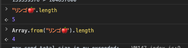

# js-primer-tutorial

## 値の評価と表示
- ブラウザのREPLで`shift + enter`で複数行入力出来る。

- ウェブページリロードでREPLの実行状態をリセット
- 自動表示はREPLの機能
- // => 評価結果 という書き方は良さそう

## データ型とリテラル
- オブジェクト型とは、複数のプリミティブ型の値またはオブジェクトからなる集合のこと
- オブジェクト型は参照型
- typeof演算子はプリミティブ型とオブジェクト型かを判定するもの。オブジェクトの詳細な種類を判定できない
- "" や '' や `` はすべて文字列型。 ""や''は改行したい場合、\nが必要。テンプレートリテラルは\nが必要ない。
- リテラルとは、プログラム上で数値や文字列など、データ型の値を直接記述できるように構文として定義されたもの。 {}はオブジェクトリテラル -> オブジェクトとしてデータ型を定義できる
- undefinedはただのグローバル変数でundefinedという値を持っているだけ。true や false、 nullはリテラルであるため、同じ名前の変数を定義できない。
- オブジェクト型のドット記法は変数名と同じく識別子である必要があるため、数値から始める識別子は利用できない
- / /とスラッシュで囲むと正規表現リテラル。正規表現のデータ型になる。（オブジェクト）
- 明示的にラッパーオブジェクトを使う理由はない。JavaScriptではプリミティブ型のデータに対してもオブジェクトのように参照できる仕組みがあるから。（lengthプロパティにアクセスできる）
  - プリミティブ型のデータのプロパティにアクセスする際に、対応するラッパーオブジェクトへの暗黙的に変換してプロパティにアクセスするから。

## 演算子
- 演算子の対象のことを被演算子（オペランドと呼ぶ）オペランド1 演算子 オペランド2
- 単項演算子と二項演算子
- ** べき乗演算子はES2016から
- NaNはNot a Numberの略で数値ではないがNumber型を表現。NaNはどの値とも一致しない特性があり、Number.isNaNメソッドでNaNを判定できる
- インクリメント演算子
  - 前置の場合 num++
    1. numの評価結果を返す
    2. numに対して+1する
  - 後置の場合 ++num
    1. numに対して+1する
    2. numの評価結果を返す
- === 厳密等価演算子は同じ型で同じ値である場合にtrueを返す
  - オブジェクト同士の場合、参照が同じである場合にtrueを返す
- == 等価演算子はオペランド同士が異なる方の値であった場合に、同じ型となるように暗黙的な型変換をしてから比較するため、予測できない挙動が多く存在する。
- null と undefinedの比較の場合、 == で判定出来るため、1度の比較でよくなる。これは例外的なケースであるため、仕組みを理解するまでは常に厳密等価演算子を利用することを推奨。
- ~ 否定演算子は1の補数を返すため、~indexOfメソッドを使ったイディオムが一部では使われていた。
- 代入演算子は二項演算子と組み合わせて利用できる /= *= &=
- 論理演算子の短絡評価は便利だよね〜 x || y で xがtrueだったらyが評価されずにyを返すやつ。 && も似たような感じ。
  - ES2020からnullish coalescing operator使えば、falsyな値でも null or undefinedの場合のみデフォルトの値を返すようになる。
- 安易に!!によるbool変換に頼るより、明示的に出来る方法 str.length > 0 などにした方が可動性高まる

## 暗黙的な型変換
- Booleanコンストラクター関数を使うことで、任意の値をtrueまたはfalseの真偽値に変換できる。REPLでさっと検証できそう
- 暗黙的な型変換より、明示的な型変換
- 明示的に変換でも解決しないことがある（NaNなど） 例外処理や型を付けるなど解決策はある。そもそも受け付けなければOK
- 空文字判定など、型変換以外の方法もある（.length === 0）

## 関数と宣言
- ES2015でデフォルと引数が導入されるまでは、OR演算子を使ったデフォルト値の指定がよく利用されていた prefix || "デフォルト"
  - ただし、falsyな値の場合、デフォルト値になるため、""（空文字列）を指定した場合にもデフォルト値が入る。意図した挙動なのかわかりにくくなる
  - デフォルト引数は、引数が渡されなかった場合のみデフォルト値が入る
- Rest parameters（残余引数） function fn(...args)  に配列を展開して関数の引数に渡すSpread構文もある fn(...array)
- 可変用引数を実現したい時にarguments変数よりRest parametersでの実装を推奨
- 関数の引数においても分割代入が利用できる。これ初見読めなかった。
```javascript
const user = {
  id: 42
};
function printUserId({ id }) {
  console.log(id)
}
printUserId(user)
```
- 関数の引数における分割代入は、オブジェクトだけでなく配列についても利用できる
```javascript
function print([first, second]){

}
const array = [1, 2]
print(array)
```
- 関数はオブジェクトの1種。ただのオブジェクトと異なり、関数名に（）をつけることで、関数としてまとめた処理を呼び出せる。オブジェクトであるため、定義した関数を変数へ代入できる。関数が値として扱えることを第一級関数（ファーストクラスファンクション）と呼ぶ。
- 関数式とは、関数を値として代入している式の事。関数宣言は文だったが、関数式では関数を値として扱っている。
- Arrow Functionの特徴
  - thisが静的
  - 常に匿名関数（functionの関数式の場合、名前をつけられて、再帰的な処理も書くことができる）
  - arguments変数を参照できない
  - functionキーワードに比べて短く書くことが出来る
  - newできない（コンストラクタ関数ではない）
- Arrow Functionはfunctionキーワードと比べて、thisの問題を多く解決したり、arguments変数が使えないため、人による解釈や実装の違いが生まれにくいため、問題ない場合はArrow Functionで書くことを推奨。
- 同じ名前の関数宣言は上書きされる。varと同じ。これはJavaScriptの巻き上げによるものだと思う。同じ名前にすることは基本的に避けるべきであり、引数の数で関数を分けたい場合は、別々の名前 or 関数内部で引数の処理を分岐
- ES2015からメソッドの短縮記法がある。オブジェクトリテラルの中でメソッド名() {} と書くことが出来る
```javascript
const obj = {
  method() {
    return 'this is method';
  }
}
console.log(obj.method())
```
- 関数文と関数式の違いは巻き上げの有無と匿名関数が可能くらいかな。コールバック関数として関数文も使えたし。
- functionキーワードとArrow functionは割と違う

## 文と式
- 式とは、値を生成し、変数に代入できるもの
- 文とは、処理する1ステップが1つの文

- ブロック文を使うと、REPLで試行錯誤しやすい（スコープが限定されるため、同じ変数でconst let宣言できる）
- JavaScriptは文（Statement）と式（Expression）から構成される
- 文は式になれない（if文や関数宣言は変数に入れられない（関数式は式））
- 式は文になれる（式文）
- 式の末尾にはセミコロン
- 文の処理の一部として式を含むことがある（if文の条件の所は式）
- ブロックで終わる文は例外的にセミコロンをつけなくてよい

## 条件分岐
- 1行のときのみ {} ブロック省略できるが、どこまでがif文かが分かりにくくなるため、常にブロックで囲むことを推奨
- if文の条件式にtrueまたはfalseといった真偽値以外の値も指定可能。真偽値以外の値の場合、暗黙的に真偽値に変換して条件式で判定
- break;を忘れると意図しないcase節が実行されてしまうため、多用されているswitch文が出てきた場合、別の方法で書けないかを考えるべきサイン。returnを返すパターンが多い。（break要らない）

## ループと反復処理
- 無限ループはブラウザの場合、ページまたはブラウザそのものを閉じることで強制終了。Nodeは終了シグナル（ctrl + c）で強制停止
- 引数として渡される関数のことをコールバック関数と呼ぶ。
  - コールバック関数メリット: 渡す関数だけ変えて、ロジックだけを変更していくことが可能。柔軟な関数
- コールバック関数を引数として受け取る関数やメソッドのことを高階関数と呼ぶ（戻り値もあったはず）
  - 高階関数メリット: ロジックを使い回すことができ、コードも短くて何をしているのか見通しが良くなること
- 配列のメソッド
  - forEach 配列の要素数だけ反復処理 -> lengthでfor回す記法などを短縮できる
  - some 一度でもtrueを返した時点で反復終了 -> break;やreturnで処理を終わらせる記法などを短縮できる
  - filter 絞り込み trueを返した要素のみの新しい配列を返す -> continueで新しい配列を作る記法などを短縮できる。
- for...inは避ける。親オブジェクトまで列挙可能なものがあるか探索して列挙するため、意図しない結果になる。安全にオブジェクトを列挙するにはObject.keysメソッド、values、entriesを使う
- ES2015からfor...of文が書けるようになった。iterable（反復可能）。（pythonの場合、inで書くやつ）
  - 反復可能な王bジェクトはIterable
  - IterableなオブジェクトはIteratorを持つ
  - for...of文で簡単にIterableを反復処理できる
  - Symbol.iteratorで返す関数を書けば自作することも可能
- forのインクリメントする場合、let。for...ofなどはループの度にブロックで囲まれて実行される。そのためconstで宣言。https://github.com/asciidwango/js-primer/issues/567

## オブジェクト
- オブジェクトのプロパティ名はは`""`や`'`を省略できるが、変数の識別子として利用できないプロパティは`""`や`'`で囲む必要がある。
  - 変数の識別子として利用できないのであれば、ドット記法でも呼び出せない
- ES2015からプロパティ名と変数名が同じであれば省略できる
```javascript
const name = "名前"
const obj = {
  name
}
```
- プロパティを初期化時以外に追加してしまうと、そのオブジェクトがどのようなプロパティを持っているかが分かりにくくなる。できる限り作成後に新しいプロパティは追加しない。
- Object.freezeを使うと、プロパティの変更や追加を行おうとすると例外が発生する。ただし、strict modeと合わせて使わないと、無視される
- プロパティ名が間違えていた場合にも、例外が発生しない。さらにプロパティ名をネストしてアクセスした場合に、はじめて例外が発生する。
  - undefinedで比較すると、プロパティの値がundefinedの可能性があるため、keyがないのか、プロパティ名がundefinedか分からない問題
  - in演算子かhasOwnPropertyを使う
  - 厳密には違うからプロトタイプオブジェクト章で解説
```javascript
const obj = { key: undefined };
// `key`プロパティを持っているならtrue
if ("key" in obj) {
    console.log("`key`プロパティは存在する");
}
if (obj.hasOwnProperty("key")) {
    console.log("`object`は`key`プロパティを持っている");
}
```
- [ES2015] Object.assignは第一引数に空の配列を指定して既存のオブジェクトに影響を与えずにマージするのが典型的な利用方法
```javascript
const merged = Object.assign({}, objectA, objectB);
```
```javascript
// 既存のオブジェクトに追加する場合。
// objectAの値が変わる
const merge = Object.assign(objectA, objectB)
```


- [ES2018] オブジェクトに対するspread構文が追加された。必ず新しいオブジェクトを生成する。spread構文はオブジェクトリテラルの中でのみ記述でき、オブジェクトリテラルは新しいオブジェクトを作成するから。
```javascript
const objectA = { a: "a" }
const objectB = { b: "b" }
const merged = {
  ...objectA,
  ...objectB
}
```
- Object.assignメソッドはshallow copyする。ネストした先のオブジェクトまで複製するわけではない
- 

## プロトタイプオブジェクト
- toString以外にもオブジェクトに自動的に実装されるメソッドのことをビルトインメソッドという
- Object以外のオブジェクトはObjectを継承している
  - 正確にはObject.prototypeプロパティに定義されたprototypeオブジェクトを継承している
- in演算子はオブジェクト自信が持っていなければ、そのオブジェクトの継承元であるprototypeオブジェクトまで探索する。だからfor...inはNGってことかな
- オブジェクトリテラルはObject.prototypeオブジェクトを自動的に継承したオブジェクトを作成している
- ArrayのインスタンスはArray.prototypeを継承していて、Array.prototypeはObject.prototypeを継承している
- Object.prototypeは全てのオブジェクトの親となるオブジェクト。Array.prototypeなどもそれぞれ独自のメソッドを定義しており、配列のインスタンスでtoStringメソッドを呼び出すとArray#toStringが優先して呼び出される。インスタンスメソッドが優先される。
- 例外としてObject.create(null)でObject.prototypeを継承しない、プロパティやメソッドをまったく持たないまったく持たない本当にからのオブジェクトが作れる
- 子は親のプロパティを共通で使える。**newをしても、関数は無駄に生成されない。**汎用的な関数はprototypeに定義。インスタンスはその同じ関数を使う。

## 配列
- 配列は常にlengthの数だけ持っているとは限らない。[,,1]という感じで、疎な配列を定義することもできる。逆に、隙間なくすべてのインデックスに要素がある配列を密な配列と呼ぶ。
- 配列もオブジェクトの一種でtypeof演算子の結果が"object"になる（文字列はstring, 関数はfunction, 数値はnumberになった。）そのため、比較するときは、Array.isArray()が良い。
- TypedArrayという固定長でかつ型つきの配列を扱う別のオブジェクトが存在し、WebGLやバイナリを扱う場面で利用される。プリミティブ型の値はそのままでは扱えないため、通常の配列とは用途や使い勝手が異なる。
- 配列のindexを取得
  - Array.indexOf
- 異なるオブジェクトだが（参照が違う）、値は同じものを見つけたい場合は
  - [ES2015] Array.findIndex
- indexが欲しいのか値が欲しいのかより明確にコードで示す。要素自体が欲しいと表現
  - Array.find
- 指定範囲の要素を取得
  - Array.slice
- findIndexやfindは過剰な機能を持っている。含まれているかだけ知りたい場合（真偽値）は
  - [ES2016] Array.includes
- 異なるオブジェクトだが、値が同じものを含まれているか真偽値が欲しい
  - Array.some
- push, popで追加や取得（削除）ができる（LIFO）。unshift, shiftを使うと、配列の先頭に追加、取得（削除）。
- concatで配列を結合し、新しい配列を作成できる（spread構文でも同じことが出来る[ES2015]）
  - spread構文は任意の位置に展開できる
```javascript
const array = ["A", "B", "C"];
const newArray = ["X", ...array, "Z"];
console.log(newArray); // => ["X", "A", "B", "C", "Z"]
```
- 配列をフラット化し、新しい配列を返す
  - [ES2019] Array.flat

```javascript
const array = [[["A"], "B"], "C"];

// 引数なしは 1 を指定した場合と同じ
console.log(array.flat()); // => [["A"], "B", "C"]
console.log(array.flat(1)); // => [["A"], "B", "C"]
console.log(array.flat(2)); // => ["A", "B", "C"]
// すべてをフラット化するには Infinity を渡す
console.log(array.flat(Infinity)); // => ["A", "B", "C"]
```

- 任意の場所を削除・追加
  - Array.splice

- 破壊的なメソッドと非破壊的なメソッド
  - 破壊的なメソッド: 配列オブジェクトそのものを変更し、変更した配列または変更箇所を返すメソッド。元も変更される。
  - 非破壊的なメソッド: 配列オブジェクトのコピーを作成してから変更し、そのコピーした配列を返すメソッド
- 破壊的なメソッドは意図しない副作用を与えてしまうことがある。
- 破壊的なメソッドと非破壊的なメソッドが混在しているため、統一的なインターフェースで扱えないのが現状。そのため、配列を扱う様々なライブラリが存在し、非破壊的な配列を扱うライブラリもある。immutable-array-prototype

- 配列のように扱えるが配列ではないオブジェクトのことを、Array-likeオブジェクトと呼ぶ
  - argumentsはforEachを持っていなかったり。
- Array-likeオブジェクトは配列のようで配列ではないというもどかしさを持つオブジェクト
  - [ES2015] Array.fromで配列に変換してしまえばArrayメソッドも利用できる

- メソッドチェーンとは名前のとおり、メソッドを呼び出した返り値に対してメソッド呼び出しをするパターンのこと
  - 見た目を簡潔にできる
  - 配列に限ったものではないが、配列では頻出
    - データを表示する際には、加工することがほとんどだから
    - 配列には配列を返す高階関数が多く実装されているため、配列を柔軟に加工できる

- まとめ
- 配列は順序を持った要素を格納できるオブジェクトの一種
- 配列には破壊的なメソッドと非破壊的なメソッドがある
- 配列には反復処理を行う高階関数となるメソッドがある
- メソッドチェーンは配列のメソッドが配列を返すことを利用している

## 文字列
- 文字へのアクセスは配列と同様にstr[0]でアクセスできる
- 文字列はそのまま保存できないため、0と1からなるビット列へ変換する必要がある -> 符号化（エンコード）という
- JavaScriptはUnicodeを採用している。Unicodeはすべての文字（制御文字などの画面に表示されない文字も含む）に対してIDを定義する目的で策定されている仕様。エンコードする方式として、UTF-16を採用している。
- UTF-16とは、16bitのビット列に変換するエンコード方式のこと。
- Unicodeでは1文字を表すのに使う最小のビットの組み合わせをCode Unitと呼び、UTF-16では16bit（2バイト）を指す。
- JavaScriptの文字列の各要素はUTF-16のCode Unitで構成されている
- 関係演算子での文字列比較はCode Unit同士を比較しているが、結果を予測することは難しく、直感的ではない。
  
- 正規表現
- RegExpリテラルは、実行時ではなく、ソースコードロード時にSyntaxエラーが発生する
- RegExpコンストラクタは実行時に正規表現のパターンが評価されるため、変数を含んだ正規表現オブジェクトを作成できる
- 正規表現リテラルで書ける場合は、利用したほうが簡潔でパフォーマンスも良い。変数などを利用する場合は、RegExpコンストラクタを使用する。
- String#matchメソッドはgをつけることでマッチするすべてを取得する。lengthでマッチした数を取得できる。それを使って配列から抽出できる。
- String#matchメソッドとRegExp#execメソッドはどちらも`g`フラグによって挙動が変わる。RegExp#execメソッドは、正規表現オブジェクトのlastIndexプロパティを変更するという副作用を持つ。
- キャプチャリングに対応している。キャプチャリングとは、正規表現中で`/パターン1(パターン2)/`のように、カッコで囲んだ部分を取り出すこと。
- 正規表現とStringメソッド両方で同じことができる。
  - 正規表現は柔軟で便利だが、コードから意図が消えやすい。コメントや変数名で具体的な意図を補足したほうが良い。
  -  Stringメソッドで表現できることはStringメソッドで表現し、柔軟性や曖昧な検索が必要な場合はコメントとともに正規表現を利用するという方針を推奨します。

- 文字列の組み立て
- URLなど、+で結合すると / がある時とないときで揺れが生じる。揺れを吸収するのが、replace(/\/$/, "")などがあるが、専用の仕組みがあるときはそれを使ったほうが良い。（URLオブジェクトなど）

- テンプレートリテラル
- 関数`テンプレート`` と記述することで、関数が受け取る引数にはタグつきテンプレート向けの値が渡ってくる
  - 関数の第一引数にはテンプレートの中身が${} で区切られた文字列の配列、第二引数以降は ${}の中に書いた式の評価結果が順番に渡される

## 文字列とUnicode
- Code Point: 文字に対する一意のIDのこと
- Code Unit: JavaScriptの文字列の構成要素はUTF-16で変換されたもの（は1文字を表すのに使う最小のビットの組み合わせ）
- UTF-16: ある1つの文字に対応するIDであるCode Pointを16bitのCode unitで表現するのがUTF-16

- Code PointとCode Unitの違い
- 特定の範囲はCodePointもCodeUnitも同じになるが、絵文字は異なる値になる
- UTF-16で表現できる範囲は、65536種類。Unicodeに登録されているCode Pointは10万種類。そのため、1対1の関係で表すことが出来ない
- このような場合に、UTF-16では2つCode Unitの組み合わせで1つの文字を表現する。この仕組をサロゲートペアと呼ぶ

- `u`フラグを付けていない正規表現は、文字列をCode Unitが順番に並んだものとして扱っている。そのため、意図しない結果になるため、`u`をつけて、サロゲートペアにする。
- JavaScriptには、文字列におけるCode Pointの個数を数えるメソッドは用意されていない。そのため、Code pointごとに区切った配列へ変換して、配列の長さを数えるのが簡潔。
  

- しかし、Code Pointの数を数えた場合でも、直感的な結果にならない場合もある。（制御文字などの視覚的に見えないものも定義されているから）ビルトインメソッドにはこれらを簡単に扱う方法は用意されていない。
- Array.fromメソッドを使って、filterなどを使えば、Code Pointごとに反復処理ができる（for...ofも可能）
- 近年は絵文字を利用するケースが多くなってきたため、Code Pointを意識したプログラミングが必要となるケースも増えている

## JSON
- JavaScript Object Notationの略、JavaScriptのオブジェクトリテラルをベースに作られた軽量なデータ・フォーマット
- 人間にも読み書きが容易で、マシンにとっても簡単にパースや生成が行える
- オブジェクトリテラルのキーを必ずダブルクォートで囲まなければならない
- 外部プログラムとデータを交換する用途がほとんどで、データが常にJSONとして正しい保証がないため、JSON.parseメソッドは基本的にtry...catch構文で例外処理するべき
```javascript
try {
    const json = JSON.parse(userInput);
} catch (error) {
    console.log("パースできませんでした");
}
```
- JSON.stringify: オブジェクトをJSON文字列に
- JSON.parse: JSON文字列をオブジェクトに
- 両方ともtry...catch構文で安全に

## ECMAScriptモジュール
- 副作用のためのインポート
  - グローバルのコードを実行するだけで何もエクスポートしないものがある
  - これが、importしたら、勝手に実行された正体
```javascript
window.foo = "foo";
```
```javascript
// グローバルコードが実行される
import "./side-effects.js";
```
- type="module"を使うと、DOM構築後に実行する
- import export文を使うには必要な構文
- 強制strictモードになる


## ECMAScriptモジュール
- ES4の時に多くの変更を取り入れることを試みたが、最終的に合意できなかったからプロポーザル単位になった
- ステージ4となったプロポーザルはドラフト版であるGitHubの`tc39/ecma262`にマージされる。そして、毎年決まった時期に`ECMAScript 20XX`としてリリースされる
- ステージ3以下は`tc39/proposals`に載っているため、過程や最新の正確な情報を知りたい場合に参照する。
- ステージ4未満はまだ安定していない。
- 常に追うのも良いけど、調べたい時に知る手段を知っておくだけで違う
- 
## TODO
- [ ] Symbol何に使う
- [x] ビルトインオブジェクト is 何
  - あらゆるオブジェクトの元となるObject のこと
  - ビルトインオブジェクトは実行環境に組み込まれたオブジェクトのことです。 
  - ObjectというビルトインオブジェクトはECMAScriptの仕様で定義されているため、あらゆるJavaScriptの実行環境で利用できます。


- [ ] プロトタイプチェーン
- [ ] strictモードに自動でなる条件

## 章
- [x] プロトタイプオブジェクト
- [x] 配列
- [x] 文字列
- [x] 文字列とUnicode
- [ ] ラッパーオブジェクト
- [ ] 関数とスコープ
- [ ] 関数とthis
- [ ] クラス
- [ ] 例外処理
- [ ] 非同期処理
- [ ] Map/Set
- [x] JSON
- [x] Date
- [x] Math
- [x] ECMAScriptモジュール
- [x] ECMAScript